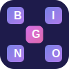

# Corporate Buzzword Bingo

<div align="center">
  
  <h3>Making meetings bearable since the age of AI</h3>
</div>

Corporate Buzzword Bingo is a satirical web-based game designed to make corporate meetings more entertaining by tracking the buzzwords and phrases that dominate business discussions.

## Features

- **Interactive 5x5 Bingo Cards**: Click squares when you hear buzzwords during meetings with satisfying "HEARD" stamp effect
- **Multiple Meeting Types**: Choose from a variety of meeting scenarios (All-Hands, Town Hall, Strategy, Budget, and more)
- **Multi-Card Gameplay**: Generate and play with multiple bingo cards simultaneously
- **Themed Card Designs**: Each meeting type has its own unique visual style and thematic elements
- **Celebration Effects**: Enjoy confetti animations when you achieve bingo
- **Gorgeous UI/UX**: Modern, vibrant design with glassmorphism effects, animations, and particle backgrounds
- **Social Sharing**: Share your completed bingo cards via a modal with instant screenshot capability
- **Mobile-Responsive**: Works on all devices, so you can play discreetly during any meeting
- **Accessibility Features**: Support for reduced motion preferences and keyboard navigation
- **Fun Meeting Statistics**: Dynamic ticker showing humorous stats about corporate meetings
- **Progressive Web App**: Install the app on your device for offline access
- **SEO Optimized**: Complete with meta tags and social media preview images

## Technology Stack

- **Frontend**: React.js with TypeScript and Vite
- **UI Framework**: Tailwind CSS with Shadcn UI components
- **Animation**: Framer Motion for smooth interactions and transitions
- **Special Effects**: Canvas Confetti for celebration animations
- **State Management**: React Context API and hooks
- **API Client**: TanStack Query (React Query)
- **Routing**: Wouter for lightweight client-side routing
- **Image Sharing**: HTML2Canvas for card screenshots
- **Storage**: In-memory database with persistence
- **Bundler**: Vite for lightning-fast development
- **Backend**: Express.js for server-side operations
- **PWA Support**: Full progressive web app capabilities
- **Error Handling**: Robust client and server error management

## Getting Started

### Prerequisites

- Node.js (v18 or later)
- npm or yarn

### Installation

1. Clone this repository:
   ```
   git clone https://github.com/yourusername/corporate-buzzword-bingo.git
   cd corporate-buzzword-bingo
   ```

2. Install dependencies:
   ```
   npm install
   ```

3. Start the development server:
   ```
   npm run dev
   ```

4. Open your browser and navigate to `http://localhost:5000`

## How to Play

1. Select a meeting type from the dropdown menu (All-Hands, Town Hall, Strategy, etc.)
2. Click "Generate Bingo Card" to create your themed card
3. During your meeting, listen for the buzzwords displayed on your card
4. When you hear a buzzword, click on its square to mark it with a "HEARD" stamp
5. Complete a row, column, or diagonal to get a BINGO and enjoy the confetti celebration!
6. Use the "Share Card" button to capture and share your completed card with colleagues
7. Click "Reset Card" to start a new game or try a different meeting type

## Customization & Adding Content

The application comes pre-loaded with buzzwords for various meeting types. To customize:

1. **Add New Buzzwords**: Edit the buzzword lists in `server/data/buzzwords.ts` to add new terms or modify existing ones.
2. **Create New Meeting Types**: Add new meeting categories by extending the `meetingTypeData` array in the same file.
3. **Customize Card Themes**: Each meeting type can have its own visual style by modifying the themed card components.
4. **Adjust Animation Settings**: Fine-tune celebration effects and animations in the CSS files.
5. **Modify Visual Design**: Update the theme colors in `theme.json` to match your preferred aesthetic.

## Contributing

We welcome contributions to Corporate Buzzword Bingo! Feel free to submit pull requests or open issues for new features or bug fixes.

## License

This project is licensed under the MIT License - see the LICENSE file for details.

## Acknowledgments

- Created with the help of AI technology
- Inspired by countless hours of corporate meetings
- Special thanks to everyone who contributed buzzwords from their real-life experiences

---

**Note**: Corporate Buzzword Bingo is meant for entertainment purposes only. Please use responsibly and don't get caught playing during important meetings!